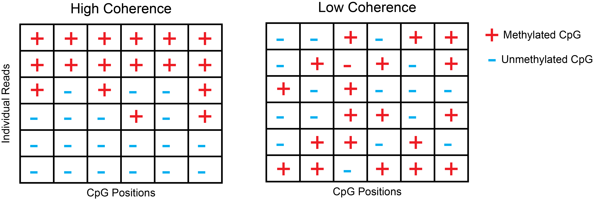
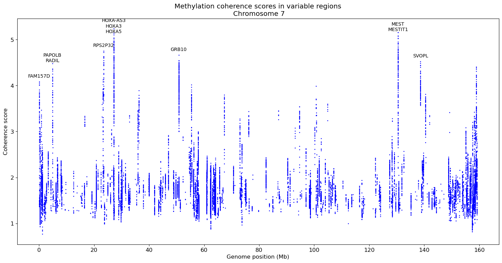

# CpG Methylation coherence analysis
A preliminary analysis pipeline to find regions of high CpG methylation coherence from long read sequencing data. We define these as regions a set of CpG sites that are variably methylated in aggregate, but where the sets of CpGs on individual reads are consistently methylated or unmethylated. These regions are commonly a result of parental imprinting but can also be a result of epigenetic differences between cell types or tumoriogenic changes.

These regions are identified with a framework that compares methylation coherence across each read with that expected under a permutation model that shuffles CpG methylation values between reads. 

We produce a coherence score that is defined as the standard deviation of average read methylation divided by the same quantity observed under a permutation model. The higher the score the greater the degree of coherence. A sliding window window approach is used to efficiently find regions with sufficent numbers of CpGs with variable methylation to be tested.



## Example Usage

The pipeline requires a python environment with `tqdm`, `numpy`, `pandas` and `matplotlib`. `pyensembl` is optionally required for plotting gene names associated with highly coherent regions. The pipeline can be run with simulated example data with the following command:

```sh
python sliding_window_coherence.py  --methylation_data_path ../data/test_methylation_data.tsv.gz --out_path ../data/test_methylation_coherence_scores.tsv
```
The coherence scores for the example data can then be plotted with the following command:

```sh
python plot_correlation_scores.py --input_file ../data/test_methylation_coherence_scores.tsv  --add_annotations --plot_output ../plots/test_coherence_scores.png
```
## Input data
The pipeline requires a input tsv with CpG methylation information derived from long read sequencing. The dataframe should be for a single chromosome only and have five columns.

* **Read_Index** An index unique to each individual read.
* **Chromosome** The relevant chromosome.
* **Position** The genomic coordinate of the CpG site.
* **Methlyation** Methylation value for the CpG site, can be binary or a continuous probability. If a probability, values >0.9 are treated as methylated and <0.1 as unmethylated by default.


## Example output

Example output for chromosome 7 from HiFi pacbio sequencing of the genome in a bottle reference data HG002 is displayed below. The pipeline was run with default settings. The mean coherence score is above one, suggesting a baseline degree of methylation coherence across the chromosome. 

Many of the regions with the highest coherence scores (MEST,GRB10,HOX) are known imprinted genes on chromosome 7 [(link)](https://www.geneimprint.org/site/genes-by-species). The pipeline is able to identify these regions as having high coherence scores, suggesting that the pipeline is able to identify regions of high methylation coherence.

